# Car Parking Management System

A comprehensive, role-based car parking management system built with PHP and MySQL. 

**Developer:** Rudra Sarkar Surja (B.Sc. Computer Science and Information Technology, University of South Asia)  
**Acknowledgments:** The core logic, structure, and features of this project were generated and developed with the assistance of Claude AI from Anthropic.

---

## 1. How to Run This Project Locally

To run this project on your computer, you will need a local server environment like **XAMPP**. Follow these exact steps to get it working:

1. **Install XAMPP:** If you do not have it yet, download and install XAMPP on your computer.
2. **Move the Project Folder:** Copy your entire `parking_system` folder and paste it directly into the XAMPP `htdocs` directory. Your file path should look exactly like this: `C:\xampp\htdocs\parking_system`.
3. **Start the Servers:** Open the XAMPP Control Panel and click "Start" next to both **Apache** and **MySQL**.
4. **Set Up the Database:**
   * Open your web browser and go to `http://localhost/phpmyadmin`.
   * Create a new database named `parking_system` (Go to SQL and type the query CREATE DATABASE parking_system).
   * Click on the **Import** tab at the top of the screen.
   * Click "Choose File", select the `parking_system.sql` file from your project folder, and click **Import** at the bottom.
5. **Launch the Project:** Once the database successfully imports, open a new tab in your browser and navigate directly to the login page: [http://localhost/parking_system/login.php](http://localhost/parking_system/login.php)


---

## 2. Project Features

**Authentication & Accounts**
* Secure login with hashed passwords (bcrypt).
* Role-based access: Admin, Staff, Customer (each with their own dashboard and route guards).
* Customer self-registration.
* Real email verification on signup (Gmail SMTP + PHPMailer, random 6-digit code).
* Forgot password flow via email using the same email infrastructure.

**Vehicle Entry & Exit**
* Visual, JS-driven slot picker at entry (grouped by vehicle type, live-filtered, server-side re-validation).
* Automated email notification sent to the owner when their vehicle is parked.
* Streamlined exit process via a dropdown of only currently-parked vehicles.
* Two-step checkout: bill summary screen → payment method selection → confirmation.
* Simulated payment methods: cash, card, mobile banking.
* Downloadable/printable PDF receipt (browser print-to-PDF).

**Slot Management**
* Admin can add/delete parking slots (blocked if occupied or has history).
* Per-vehicle-type hourly rate and max parking duration, editable by admin.
* Overdue badge on the admin dashboard when a vehicle exceeds its type's time limit.
* Customer-facing live slot availability (summary counts + full color-coded visual grid).
* Slot request system: customers request a specific slot, staff approve/reject.

**Admin Tools & Reporting**
* User directory showing every user, their vehicles, and current parking status.
* Admin can edit or delete user accounts (blocked from deleting users with parking history, cannot delete self).
* Audit log tracking key actions (who did what, when) across the system.
* Live reports: today's/all-time revenue, revenue by vehicle type, average parking duration, top-used slots.
* Revenue trend line chart (Chart.js, with automatic fallback to a table if offline).
* Printable detailed PDF report.
* Google Maps location embed on the login page.

**UX/Design**
* Consistent custom UI across every page (login card, sidebar navigation, stat cards, status badges).
* Dark/light theme toggle, persisted via localStorage.


---

## 3. How to Set Up PHPMailer (Email Verification)

This project uses PHPMailer to send real verification and notification emails. For security, the original email credentials have been removed from the code. To make the email features work on your computer:

1. Go to your Google Account Settings > Security.
2. Enable **2-Step Verification**.
3. Search for **App Passwords** and generate a new 16-digit password.
4. Open the project in your code editor and locate the mail configuration file (e.g., `mail_config.php`).
5. Replace the placeholder values with your own Gmail and the 16-digit App Password:
   ```php
   $mail->Username = 'your_email@gmail.com'; 
   $mail->Password = 'your_16_digit_app_password';


   ---

## 4. Test Accounts & Login Credentials

Use the following default credentials to log in and explore the different role dashboards at [http://localhost/parking_system/login.php](http://localhost/parking_system/login.php). The password for all accounts is `1234`.

| Role | Email | Password |
|---|---|---|
| **Admin** | admin@parking.com | 1234 |
| **Staff** | staff@parking.com | 1234 |
| **Customer** | rudraasarkar017@gmail.com | 1234 |
| **Customer** | udoy@mail.com | 1234 |
| **Customer** | sidratul@tuli.com | 1234 |

*(Note: You can also register a new customer account from the login page to test the real email verification system).*


---

## 📸 System Screenshots

### Authentication & General
**Login Page**
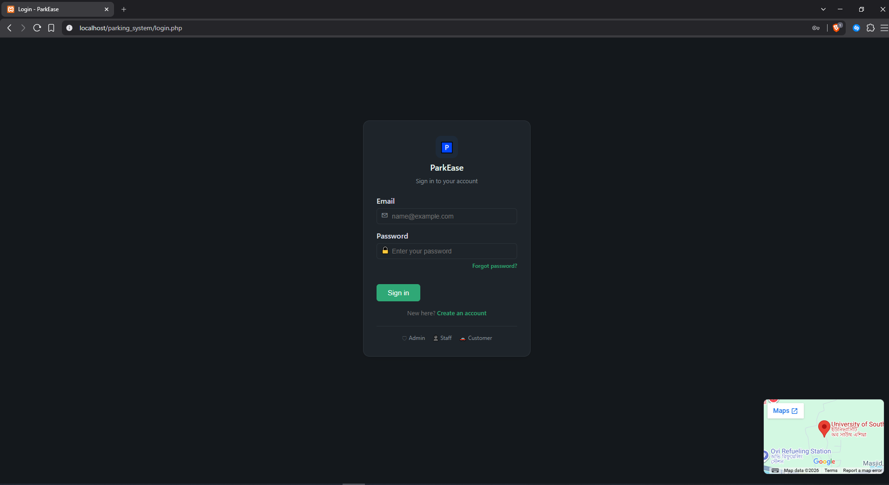

**Registration Form**
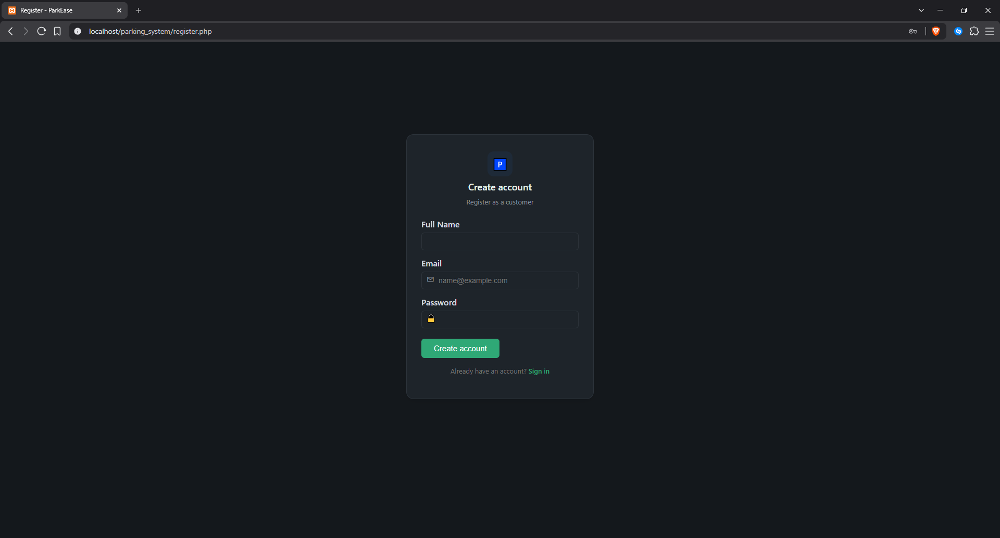

**Forgot Password**
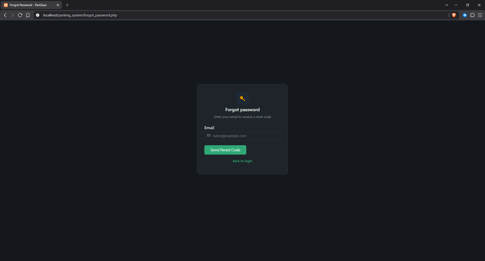

**Theme Toggle**
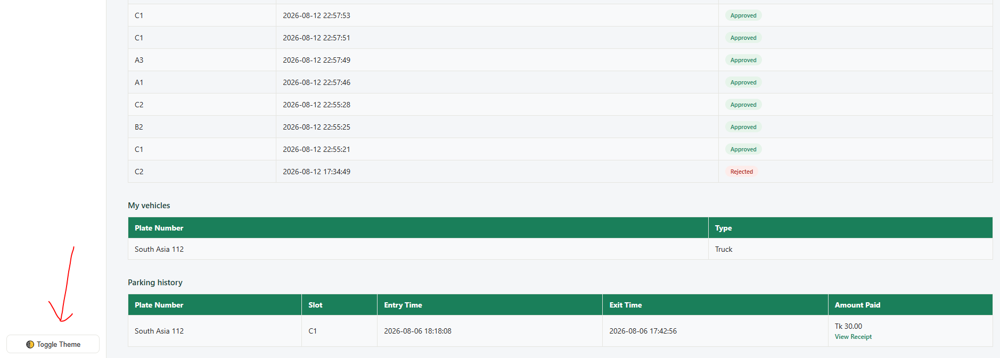

### Admin Panel
**Admin Dashboard**
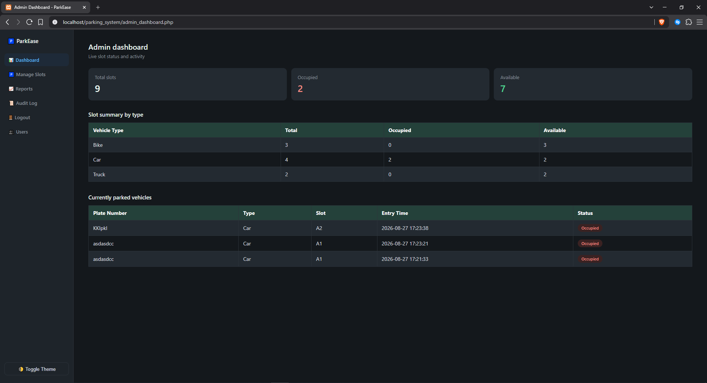

**Manage Slots**
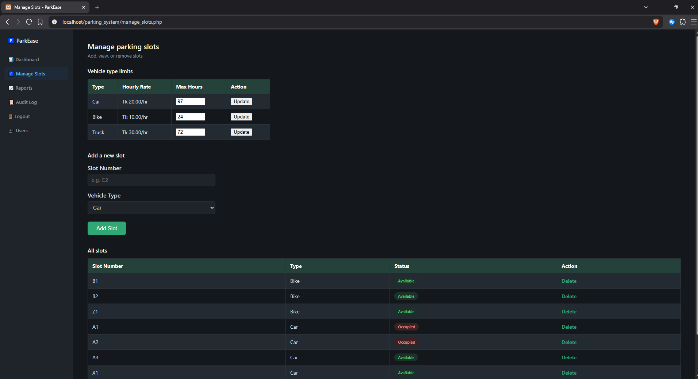

**User Management**
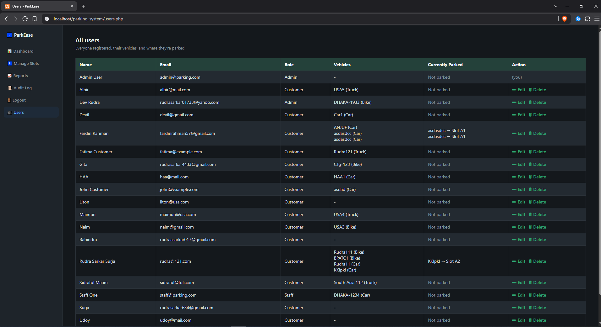

**System Reports**
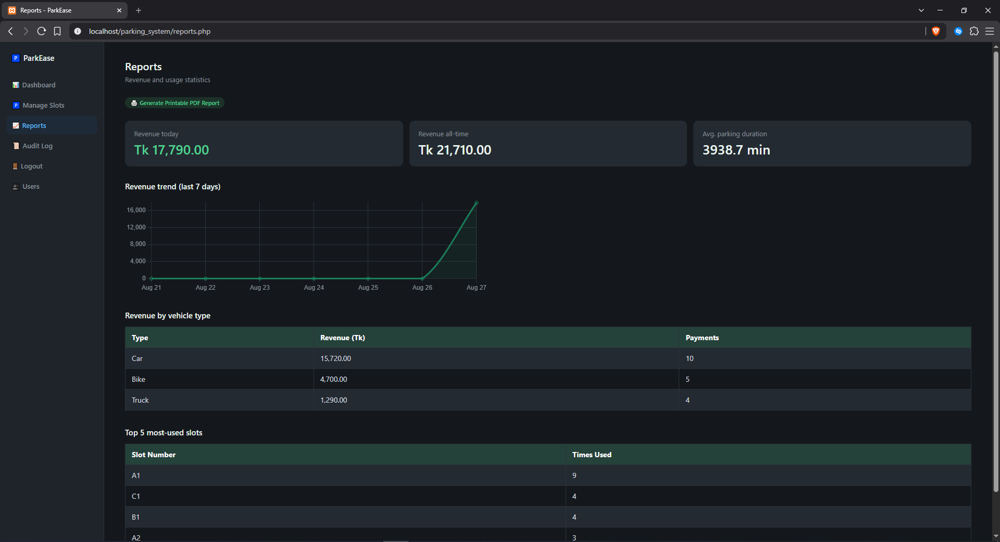

**Audit Log**
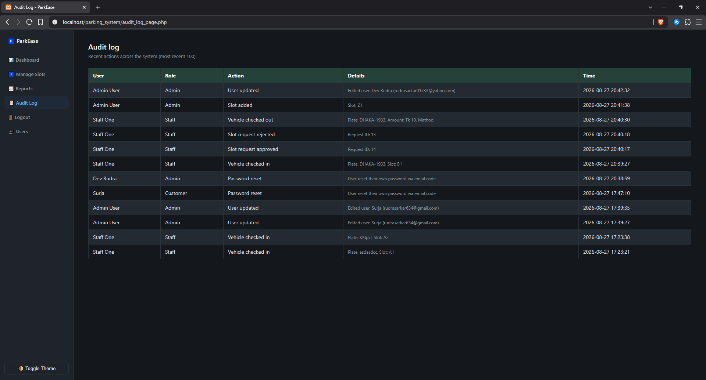

### Staff Panel
**Staff Dashboard**
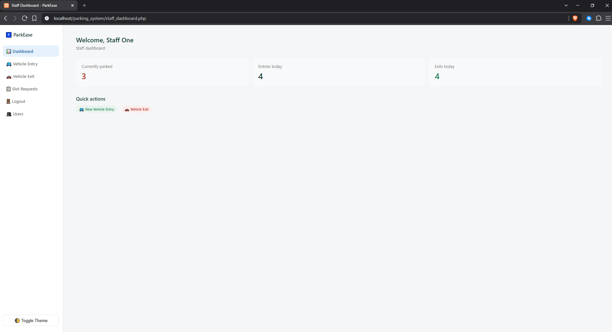

**Vehicle Entry**
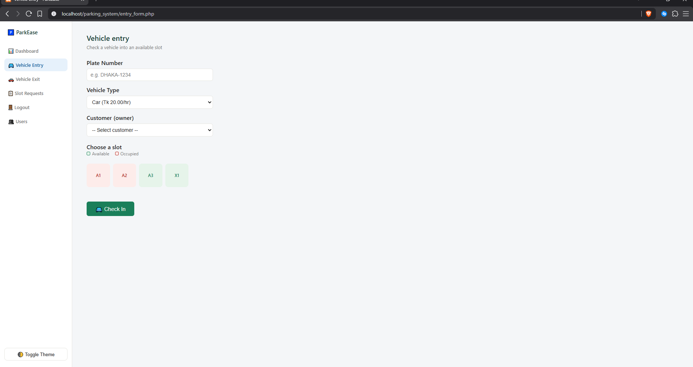

**Vehicle Exit**
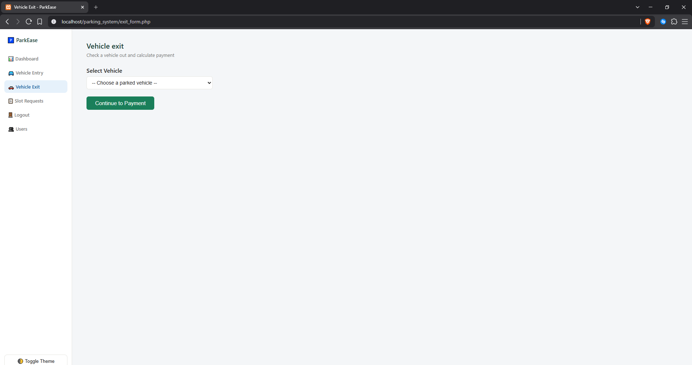

**Slot Requests**
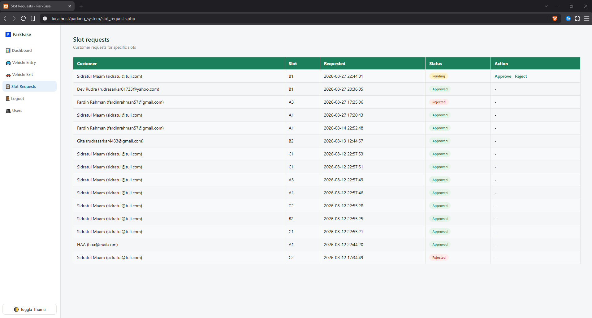

### Customer Panel
**Customer Dashboard**
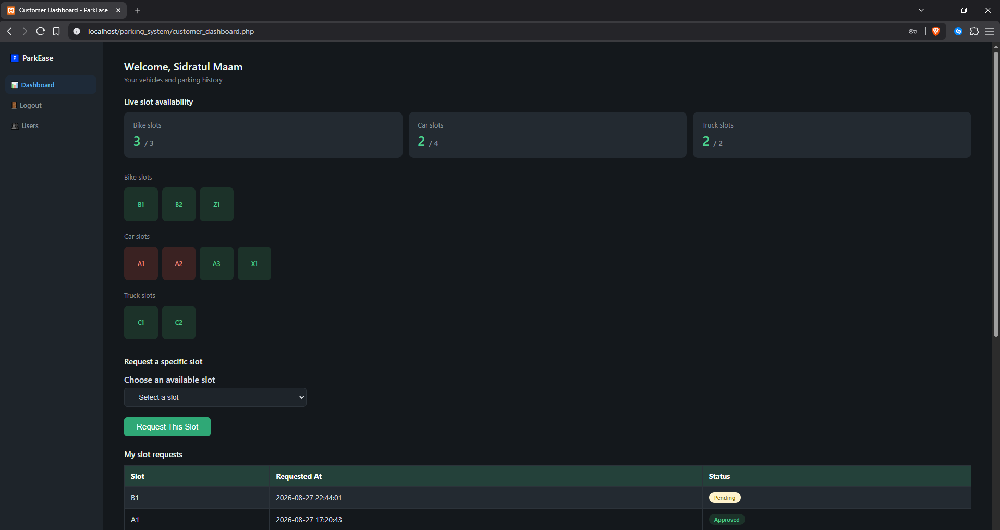

**Customer Dashboard (Alternate View)**
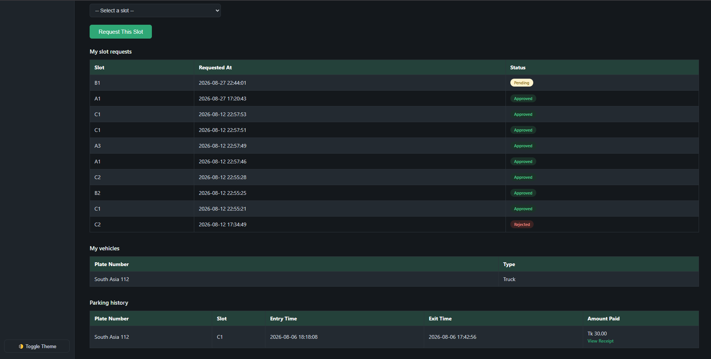
